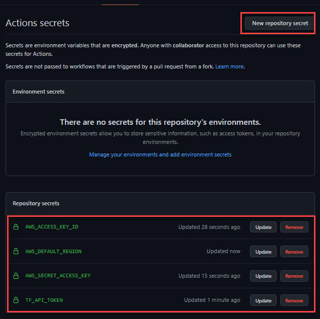

[](https://github.com/kcemenike/GithubActions_Terraform_Cloudformation/actions/workflows/aws.yml)
# GithubActions + Terraform + Cloudformation

This section shows how you can use Github actions to automate the deployment of a cloudformation stack in terraform

### Github Actions ([aws.yml](../.github/workflows/aws.yml))
  - Sets up terraform and aws configurations
  - Formats, initialises and validates terraform
  - Executes terraform plan
  - Applies terraform plan
### Terraform ([aws.tf](./aws.tf))
  - uses the aws_cloudformation_stack resource to create a stack "Test-Stack"
  - parameter (bucketID) is gotten from the `terraform` commands in aws.yml and parsed as a variable `ID`
  - template body is retrieved from the file `frontend.yml`
### Cloudformation ([frontend.yml](frontend.yml))
  - Creates a bucket with the bucket name = `github-run-$bucketID` ($bucketID is the parameter from aws.tf)
  - Exports the bucket URL as BucketID

Terraform destroys the deployment on successful completion.

To run this deployment, please do the following:

- Fork this git  
  Well, I always say this, don't I?
-  Create the following environment variables
  - TF_API_TOKEN
    - To create this, you need to do the following:
      - Create an account at https://app.terraform.io
      - Create an organisation and workspace
      - install terraform, run `terraform login`. You will be guided on how to create a token  
        ```The token is usually saved in terraform.d/credentials.tfrc.json```
  - Create Repository secrets for AWS_ACCESS_KEY_ID, AWS_SECRET_ACCESS_KEY and AWS_DEFAULT_REGION
    - To create a secret, follow [this guide](https://docs.github.com/en/actions/security-guides/encrypted-secrets)
    - If you don't have these three secrets, follow the guide to [create an IAM user with programmatic access](https://docs.aws.amazon.com/IAM/latest/UserGuide/id_users_create.html)



- Push a change to your repository